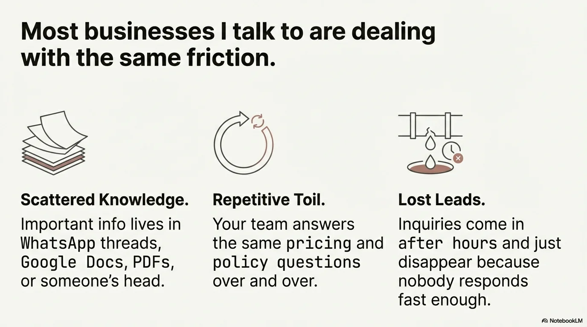
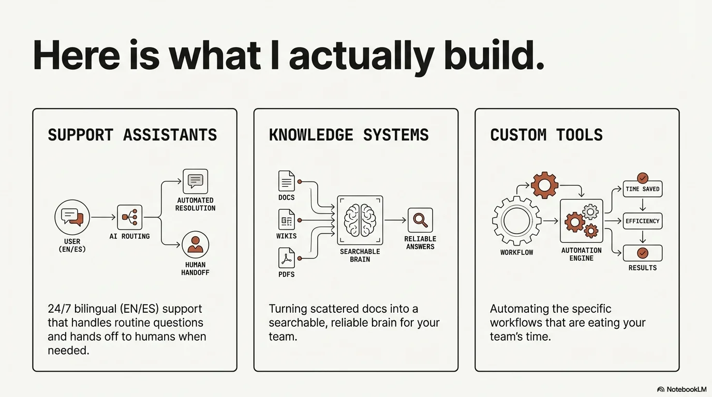
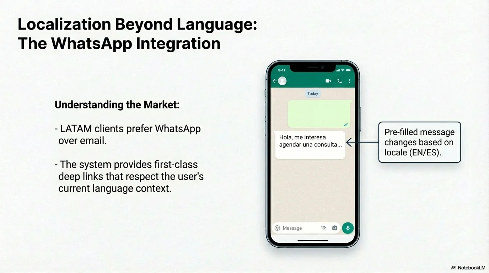
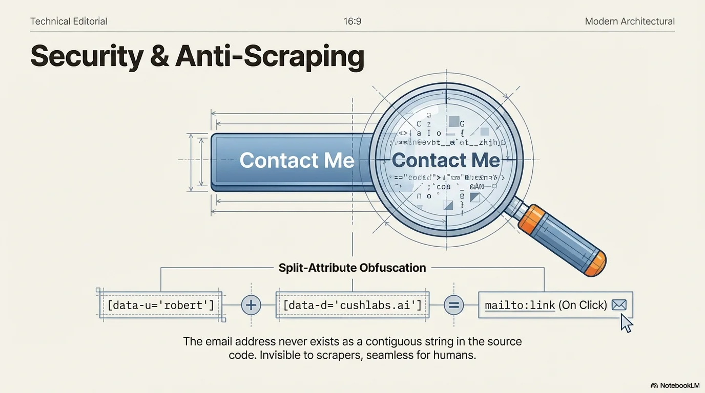
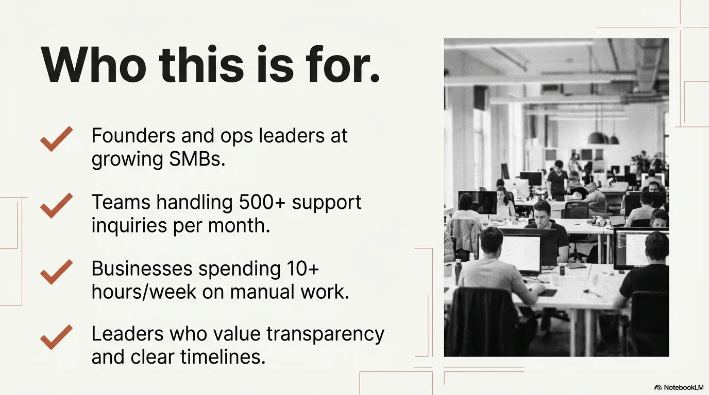

# CushLabs.ai


> AI consulting and software development for SMBs. Bilingual (EN/ES) business site with automated GitHub portfolio sync and serverless booking.

<p align="center">
  
  
  
</p>
<p align="center">
  
  
  
</p>
<p align="center">
  
  
  
</p>

## Overview

CushLabs.ai is the production website for CushLabs AI Services — an AI integration and software development consultancy serving small and mid-sized businesses in the US and Mexico. The site is fully bilingual (English/Spanish), statically generated with Astro, and designed to run itself: portfolio projects sync automatically from GitHub repos, consultations book directly through a custom serverless wizard, and a pre-deploy audit enforces bilingual parity before every build.

This isn't a brochure site with a contact form. It's an operational system where the GitHub account is the source of truth for project data, the booking flow replaces third-party scheduling widgets entirely, and the i18n system enforces that every page, translation key, and SEO tag exists in both languages — or the build fails.

## The Challenge

Building a consulting business website sounds simple until you layer in the real requirements:

- **Bilingual sites rot unevenly.** When content exists in two languages, one side inevitably falls behind. English gets updated, Spanish gets forgotten, and search engines penalize the inconsistency. Hreflang tags, canonical URLs, and sitemaps that cover both languages correctly compound the complexity. Most agencies solve this with a CMS and translation workflows. For a solo consultant, that's overhead that doesn't ship.

- **Portfolio pages go stale the moment you stop manually updating them.** Every new project means editing the site, re-deploying, and hoping the screenshots and descriptions stay current. Multiply that by two languages and the maintenance cost quietly kills the portfolio section. Most consultants let it die after 3-4 projects.

- **Third-party booking widgets break design consistency and charge monthly fees.** Calendly, Cal.com, and similar tools work, but they embed iframes with mismatched styling, add third-party JavaScript, and introduce another subscription to manage. For a premium consulting brand, the visual disconnect between a polished site and a generic booking widget undermines the message.

- **Static sites are fast and cheap but traditionally can't handle dynamic features.** Forms, booking flows, and API integrations typically require a server. Moving to a full-stack framework adds hosting costs, cold start latency, and infrastructure to maintain — all for a site that's 95% static content.

## The Solution

**Self-maintaining portfolio via GitHub sync:**
A weekly GitHub Actions pipeline scans every repository in the account, extracts `portfolio.md` metadata (title, tech stack, demo URLs, descriptions), and outputs structured JSON consumed at build time. Rich marketing content layers on top via a TypeScript override system, keeping automated data and curated copy cleanly separated. Adding a new project to the portfolio means pushing a `portfolio.md` file to any repo — the site picks it up automatically on the next build.

**Custom serverless booking wizard:**
A Cloudflare Worker replaces Calendly entirely. The 3-step booking flow (date/time, details, confirmation) authenticates to Google Calendar via OAuth2, checks FreeBusy availability, generates 30-minute slots filtering out conflicts and same-day bookings under 3.5 hours away, and creates calendar events with auto-generated Google Meet links. Rate limiting (5 bookings/hour/IP), input sanitization, and 5-minute slot caching are built in. The UI matches the site's design system — no iframe, no third-party branding, no monthly fee.

**Build-time bilingual enforcement:**
A 24-line TypeScript i18n system replaces the 40KB+ i18next library with zero runtime overhead. Every page knows its locale from the URL structure at build time. A pre-deploy audit dynamically imports both translation files and diffs every nested key, failing the build if any key exists in one language but not the other. Bilingual parity isn't a guideline — it's a gate.

**Static site with serverless escape hatches:**
Astro generates pure HTML for 95% of the site, edge-cached globally for sub-second loads. The 5% that needs dynamic behavior (booking, contact intake) routes through Cloudflare Workers — no server to maintain, no cold starts, no infrastructure cost beyond the free tier.

## Technical Highlights

- **Zero-maintenance portfolio pipeline** — GitHub Actions weekly sync with smart diffs (only commits when data changes), `[skip ci]` loop prevention, and graceful degradation when `GITHUB_TOKEN` is missing
- **24-line custom i18n** replacing 40KB+ i18next — three functions total, compile-time locale resolution, build-time parity enforcement
- **Cloudflare Worker booking system** with Google Calendar OAuth2, FreeBusy availability queries, auto-generated Meet links, IP-based rate limiting, and input sanitization
- **requestIdleCallback video preloading** — homepage video ships with `preload="none"` and upgrades to `preload="auto"` only during idle time (with Safari-specific fallback), contributing zero bytes to initial page weight
- **Split-attribute email obfuscation** — address divided across `data-u` and `data-d` attributes, assembled into `mailto:` only via client-side JS to defeat scrapers
- **Pre-deploy audit suite** running 6 checks: repo hygiene, env vars, secret leak detection (GitHub tokens, OpenAI keys), i18n parity, TypeScript validation, and build artifact verification across 13 expected HTML paths in both languages
- **Structured data** with Organization + WebPage JSON-LD schemas for rich search results
- **Accessibility-first** — semantic HTML, ARIA labels, `prefers-reduced-motion` support, WCAG AA contrast ratios

## Getting Started

### Prerequisites

- Node.js >= 18.17
- GitHub Personal Access Token with `public_repo` scope
- Google Calendar OAuth2 credentials (for booking feature)

### Installation

```powershell
git clone https://github.com/RCushmaniii/cushlabs.git
cd cushlabs
npm install
```

### Environment Variables

```powershell
cp .env.example .env
notepad .env
```

| Variable | Required | Description |
|----------|----------|-------------|
| `GITHUB_TOKEN` | Yes | GitHub PAT for portfolio sync (`public_repo` scope) |
| `GITHUB_OWNER` | Yes | GitHub username (`RCushmaniii`) |
| `PUBLIC_WHATSAPP_NUMBER` | No | WhatsApp contact number |
| `PUBLIC_CONSULTATION_URL` | No | Booking widget fallback URL |

### Development

```powershell
# Generate portfolio data from GitHub
npm run generate-projects

# Start dev server
npm run dev
# Open http://localhost:4321
```

## Live Demo

**[cushlabs.ai](https://cushlabs.ai)**

- Browse English at `/`, Spanish at `/es/`
- View the auto-synced portfolio at `/portfolio`
- Book a consultation through the serverless wizard at `/consultation`

## Project Structure

```
cushlabs/
├── src/
│   ├── components/           # Reusable Astro components
│   │   └── home/             # Homepage section components
│   ├── layouts/
│   │   └── BaseLayout.astro  # Master layout (SEO, hreflang, schema)
│   ├── pages/                # File-based routing
│   │   ├── index.astro       # Home (EN)
│   │   ├── about.astro
│   │   ├── contact.astro
│   │   ├── services.astro
│   │   ├── portfolio.astro
│   │   ├── consultation.astro
│   │   ├── blog/
│   │   └── es/               # Spanish mirror pages
│   ├── i18n/
│   │   ├── index.ts          # i18n utilities (3 functions, 24 lines)
│   │   └── translations/
│   │       ├── en.ts
│   │       └── es.ts
│   ├── data/
│   │   ├── projectDetails.ts          # Rich project content overrides
│   │   └── projects.generated.json    # Auto-synced from GitHub
│   └── styles/
│       └── global.css        # Tailwind + CSS variables
├── api/
│   └── consultation-intake.ts  # Edge function for forms
├── scripts/
│   ├── generate-projects.ts    # GitHub API portfolio sync
│   └── audit-predeploy.ts     # 6-check pre-deploy validation
├── docs/                       # Brand system, architecture docs
├── public/
│   └── images/
├── astro.config.mjs
└── package.json
```

## Deployment

The site deploys as a static build. The build command syncs GitHub portfolio data first, then generates the Astro output:

```powershell
npm run build
# Runs: generate-projects → astro build
```

A GitHub Actions workflow refreshes portfolio data weekly with smart diffing — only commits when data actually changes.

### Available Commands

| Command | Description |
|---------|-------------|
| `npm run dev` | Start dev server at `localhost:4321` |
| `npm run build` | Sync GitHub projects + production build |
| `npm run preview` | Preview production build locally |
| `npm run check` | ESLint + TypeScript validation |
| `npm run generate-projects` | Sync GitHub repos to JSON |
| `npm run audit:predeploy` | 6-check pre-deployment validation |

## Security

- API keys in environment variables only — never in client bundle
- Split-attribute email obfuscation defeats scraper bots
- Pre-deploy secret scanning for GitHub tokens (`ghp_`, `github_pat_`) and OpenAI keys (`sk-`)
- Booking API rate limiting: 5 requests/hour/IP
- Input sanitization: HTML/control character stripping, 200-char truncation on all booking fields
- CORS: configurable allowed origins on Cloudflare Worker

## Design System

| Token | Value | Usage |
|-------|-------|-------|
| `cush-orange` | `#FF6A3D` | Primary accent |
| Display font | Space Grotesk | Headings, nav, buttons |
| Body font | Source Serif 4 | Paragraphs, content |

Full brand documentation in [`docs/BRAND-DESIGN-SYSTEM.md`](docs/BRAND-DESIGN-SYSTEM.md).

## Results

| Metric | Detail |
|--------|--------|
| Portfolio projects | 27+ synced automatically from GitHub with zero manual entry |
| i18n runtime overhead | 0 KB (24-line custom system vs ~40KB+ i18next) |
| Pre-deploy checks | 6 automated validations before every production build |
| Page load | Sub-second with static HTML edge-cached globally |
| Booking cost | $0/month (Cloudflare Worker free tier vs $8-16/month Calendly) |
| Language coverage | 100% EN/ES parity enforced at build time |

The site demonstrates that a solo consultant's web presence doesn't have to choose between automation and polish. Static generation handles performance and cost. Serverless workers handle the dynamic edges. And build-time enforcement handles the quality that manual processes inevitably drop.

## Contact

**Robert Cushman**
Business Solution Architect & Full-Stack Developer
Guadalajara, Mexico

📧 info@cushlabs.ai
🔗 [GitHub](https://github.com/RCushmaniii) • [LinkedIn](https://linkedin.com/in/robertcushman) • [Portfolio](https://cushlabs.ai)

## License

© 2026 Robert Cushman. All rights reserved. See [LICENSE](LICENSE) for details.

---

*Last Updated: 2026-03-02*
